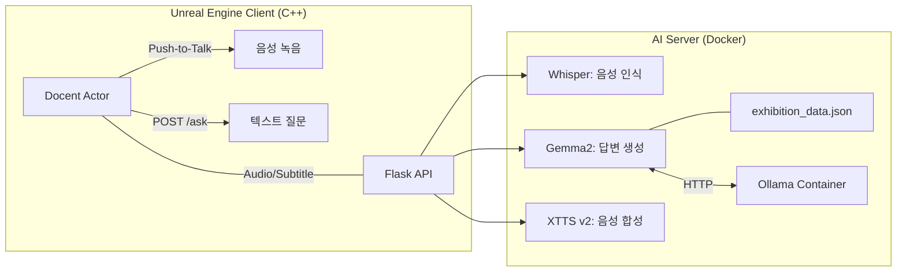

# 빈센트 반 고흐 AI 도슨트 시스템

관람객이 Unreal Engine 환경에서 가상의 빈센트 반 고흐와 음성 또는 텍스트로 대화하며 작품에 대한 깊이 있는 설명을 들을 수 있는 대화형 AI 시스템입니다.

## 시스템 아키텍처



## 기술 스택

| 구분 | 기술 | 용도 |
| :--- | :--- | :--- |
| **Engine** | Unreal Engine 5 | 인터랙티브 런타임 클라이언트 |
| **Server** | Python Flask | API 통신 및 AI 모듈 오케스트레이션 |
| **STT** | OpenAI Whisper | 사용자 음성을 텍스트로 변환 |
| **LLM** | Ollama (Gemma2:2b) | 반 고흐 페르소나 기반 답변 생성 |
| **TTS** | Coqui XTTS v2 | 고퀄리티 한국어 음성 합성 |
| **Deploy** | Docker + docker-compose | 컨테이너 기반 배포 |

---

## 🐳 Docker로 실행하기 (다른 컴퓨터에서)

### 사전 준비

1. [Docker Desktop](https://www.docker.com/products/docker-desktop/) 설치
2. **`docent_voice.wav`** 파일을 이 프로젝트 폴더에 복사
   - 이 파일은 TTS(음성 합성)의 스피커 샘플입니다
   - 보안상 GitHub에 포함되지 않으며, 별도로 공유됩니다

### CPU로 실행 (기본)

```bash
# 1. 저장소 클론
git clone https://github.com/<your-username>/<your-repo>.git
cd <your-repo>

# 2. docent_voice.wav 파일을 이 폴더에 붙여넣기

# 3. 실행 (처음 실행 시 10~15GB 이미지 다운로드, 상당한 시간 소요)
docker-compose up --build
```

서버가 준비되면 `http://localhost:6000/status` 에서 확인할 수 있습니다.

### GPU로 실행 (NVIDIA GPU 필요)

> NVIDIA Container Toolkit이 설치되어 있어야 합니다.  
> 설치 방법: https://docs.nvidia.com/datacenter/cloud-native/container-toolkit/install-guide.html

```bash
docker-compose -f docker-compose.yml -f docker-compose.gpu.yml up --build
```

### 종료

```bash
docker-compose down
```

---

## API 명세

| 엔드포인트 | 메소드 | 설명 |
| :--- | :--- | :--- |
| `/status` | GET | 서버 및 녹음 장치 상태 확인 |
| `/start` | POST | 실시간 마이크 입력 스트림 시작 |
| `/stop` | POST | 녹음 종료 및 STT → LLM → TTS 프로세스 실행 |
| `/ask` | POST | 텍스트 기반 질문 처리 및 음성 생성 |
| `/audio/<file>` | GET | 생성된 WAV 오디오 파일 스트리밍 |

### `/ask` 요청 예시

```json
POST /ask
{
    "text": "별이 빛나는 밤은 어떤 감정으로 그린 작품인가요?",
    "artwork_id": "starry_night"
}
```

---

## 핵심 기능

- 🎙️ **Push-to-Talk**: R 키를 누르는 동안 음성 녹음 → 자동 STT 처리
- 🎨 **반 고흐 페르소나**: 고흐의 감성과 언어로 한국어 답변 생성
- 🗣️ **XTTS v2 음성 합성**: 고품질 한국어 클로닝 TTS
- 🔁 **TTS 캐시**: 동일 텍스트는 캐시에서 즉시 반환

---

**작성일**: 2026년 3월  
**작성자**: AI 기술 지원 어시스턴트
